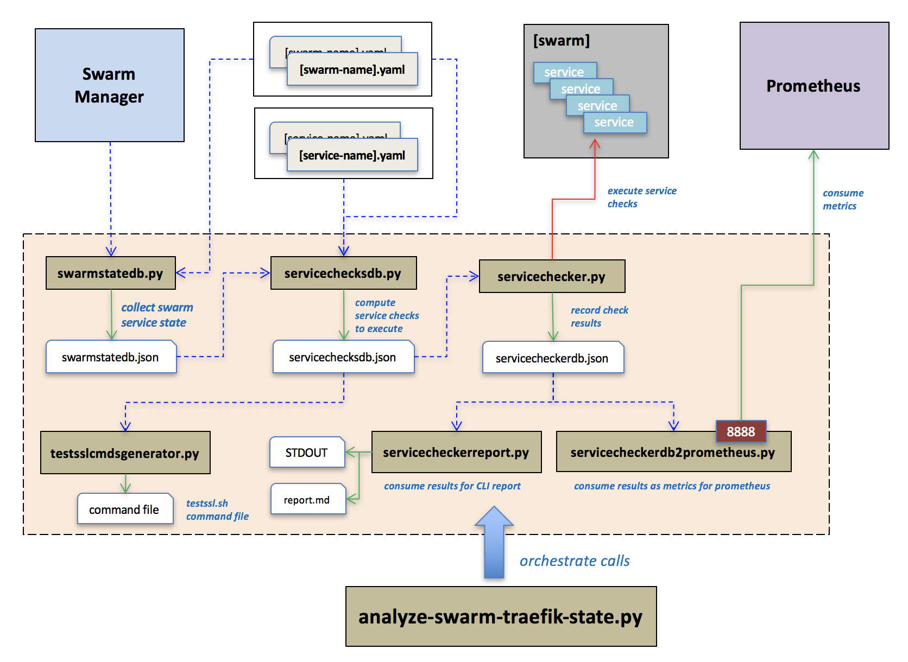

# swarm-traefik-state-analyzer

This project is intended to aid in the analysis of Docker Swarm services that are proxied by [Traefik](https://traefik.io/) in an "swarm footprint" architecture whereby services are segmented on the swarm/traefik by classification of being *internal* or *external* services. All inbound http(s) traffic for either segment passes through higher level proxies **(layer4)** or direct lb bound fqdns **(layer3)** on to its corresponding hard/software load balancer **(layer2)**, to one of several Traefik instances **(layer1)**, and then on to individual Swarm **(layer0)** service containers.


Triaging *"where the hell does the problem reside"* in such a setup can be a daunting task as there are many possible points of misconfiguration, hardware and software failures that can be the culprit.


- Are the service containers themselves ok?
- Are all my swarm nodes up?
- Is my service accessible and responding on the swarm pub port?
- Is Traefik functioning?
- Are all my Traefik labels working?
- Is Traefik on the right network to talk to the service?
- Is the DNS for these labels correct?
- Is the load-balancer pointing to the right Traefik backend?
- Is something busted in front of my load-balancer?
- Is the name/fqdn even pointing to the correct balancer or whatever is in front of that?
- Are there issues with TLS/SSL?

Ugh... well those kinds of questions is what this tool is intended to *assist* in helping to narrow down where to look next. These scripts collect relevant info from the swarm, generate all possible avenues of ingress across all layers for service checks to services on a swarm, and execute those checks giving detailed results.

By validating access directly through all possible layers of a Swarm/Traefik footprint you can help figure out what layers are having issues to properly stop the bleeding.

* [Architecture overview](#architecture)
  * [Swarm Info files](#swarminfo)
  * [Service State files](#servicestate)
* [Modules/Scripts overview](#modules)
  * [swarmstatedb.py](docs/swarmstatedb.md)
  * [servicechecksdb.py](docs/servicechecksdb.md)
  * [servicechecker.py](docs/servicechecker.md)
  * [servicecheckerreport.py](docs/servicecheckerreport_doc.md)
  * [analyze-swarm-traefik-state.py](docs/analyze-swarm-traefik-state.md)
  * [servicecheckerdb2prometheus.py](docs/servicecheckerdb2prometheus.md)
* [TLS/SSL diagnosis scripts](docs/tlsssltools.md)
  * [testsslinputgenerator.py](docs/tlsssltools.md#testsslinputgenerator)
* [Grafana dashboards](docs/grafana.md)
* [Docker](#docker)



## <a id="architecture"></a>Architecture overview

This suite of modules is built around the following simple architecture.

### Physical

* You have a Docker Swarm cluster made up of N hosts
*  The Swarm has two classifications of docker overlay networks on it
  - `external`: for services that receive requests from outside sources
  - `internal`: for services that receive requests from internal sources
*  Each network has a single designated [Traefik](https://traefik.io/) service that is published on a fixed swarm port. This Traefik service proxies all inbound HTTP/S traffic to other application services on that shared `internal` or `external` network.
*  Each fixed `internal/external` Traefik published port on the swarm (lets say `external` is 45900 and `internal` is 45800) receives its traffic from a corresponding designated internal/external load-balancer device (hardware or software) that resides on the network.
*  DNS for your deployed services points an appropriate device that will eventually proxy traffic to the appropriate internal or external load-balancer
*  Upstream from the load-balancers may be potentially other devices, firewalls, wafs, app proxies etc
*  Each of these DNS names are specified within a `traefik.[servicename].frontend.rule=Host:[name1],[nameN]..`label on each service

### Logical

*  Your applications are deployed as docker services on a target swarm.
*  An application runs within the scope of logical "context" (i.e. pre-prod, or prod, or qa etc)
*  A "context" generally implies a set of corresponding configuration that is different in some way to any other "context"
*  An application can have an optional "classifier" to give it additional categorization
*  A binary Docker image (i.e. my-app:10.0-beta-1) paired with a "context" and optional "classifier" yields an unique deployed docker service.
    * a deployed docker service has a naming convention `[appname]-[context]-[version][-classifier]` (i.e. `my-app-pre-prod-10-0-beta-1`)
*  The combination of a Docker image version, in scope of a "context" falls into one of three categories:
    * `current`: The current version of the application receiving live traffic bound to FQDNs representative of live traffic (i.e. www.my-app.test.com)
    * `previous`: The previous version of the application which receives traffic bound to unique FQDNs (i.e. my-app-pv.test.com)
    * `next`: The upcoming version of the application which receives traffic bound to special testing FQDNs (i.e. my-app-nv.test.com)
*  "Where" HTTP/S traffic goes for given standard FQDNs can easily be controlled by hot-swapping Traefik frontend rules via Docker service labels

### Deploying services

The "how" of how you deploy and manage your services based on this swarm/traefik footprint architecture and docker service naming conventions based around the [swarminfo.yml files](#swarminfo) and [service-state.yml files](#servicestate) is up to you. You can build automation around this using any programming language of your choice or DevOps toolsets like Ansible.

## <a id="modules"></a>Modules/Scripts

This project provides multiple modules who's input/output can be used between each other or each can just be used independently on their own.

1. [swarmstatedb.py](docs/swarmstatedb.md): to collect raw docker swarm service state into a JSON db
1. [servicechecksdb.py](docs/servicechecksdb.md): decorates all the layer service checks for services discovered by `swarmstatedb`
1. [servicechecker.py](docs/servicechecker.md): executes the service checks generated by `servicechecksdb`, records results
1. [servicecheckerreport.py](docs/servicecheckerreport_doc.md): reads `servicechecker` output and prepares a simple report  
1. [analyze-swarm-traefik-state.py](docs/analyze-swarm-traefik-state.md): orchestrates the above steps in one simple command
1. [servicecheckerdb2prometheus.py](docs/servicecheckerdb2prometheus.md): monitors a directory for `servicechecker` output and exposes as Prometheus`/metrics`
1. [testsslinputgenerator.py](docs/tlsssltools.md): Generates [testssl.sh](https://github.com/drwetter/testssl.sh) compatible input file from a `servicechecksdb` output file.

## Required modules to run

Python 3

```
pip install docker jinja2 pyyaml python-dateutil prometheus_client watchdog docker
```

## <a id="docker"></a>Docker

You can also run the any of the modules in this project via Docker.

Example:
```
docker build -t swarm-traefik-state-analyzer .

docker run \
  -v path/to/service-state-files-dir/:/service-state \
  -v path/to/service-info-files-dir/:/swarm-info \
  -v /tmp/output/:/output \
  swarm-traefik-state-analyzer \
  analyze-swarm-traefik-state.py \
    --job-name myapp-prod \
    --output-dir /output \
    --swarm-info-repo-root /swarm-info \
    --service-state-repo-root /service-state \
    --swarm-name myswarm1 \
    --service-filter '{"name":"myapp-prod"}' \
    --layers  3  \
    --threads 30 \
    --tags health version \
    --stdout-servicechecker-result
```

## <a id="swarminfo"></a>[swarm-name].yml files

Swarm info files, are a generic YAML declaration that describes a named swarm footprint in the described architecture above.

```yaml
SWARM_MGR_URI: "http://myswarm1.test.com:[port]"

swarm_lb_endpoint_internal: "myswarm1-intlb.test.com"
swarm_lb_endpoint_external: "myswarm1-extlb.test.com"

traefik_swarm_port_internal_https: 45800
traefik_swarm_port_external_https: 45900

contexts:
  - "prod"
  - "pre-prod"

swarm_host_info:
  template: "myswarm1-node{id}.test.com"
  total_nodes: 5

```

## <a id="servicestate"></a>service-state.yml files

Service state files, are a generic YAML declaration that describes a named "service" that can be deployed within the described architecture above on one or more target swarms


```yaml
formal_name: "my-servicename"
app_type: "go"

classifiers:
  mode-a:
    desc: "operation mode A"
  mode-b:
    desc: "operation mode B"

aliases:
  - "my-alias1"
  - "my-alias2"

service_ports:
  443:
    name: "https access port"
    desc: "description"
    protocol: "https"
    classifiers:
      - "mode-a"
      - "mode-b"

service_checks:
  - ports: [443]
    path: "/health"
    layers: [0,1,2,3]
    headers:
      - "test2: yes"
    method: "GET"
    timeout: 10
    retries: 3
    tags: ["foo","health"]
  - ports: [443]
    layers: [0,1,2,3]
    path: "/api/2.7/submit-report"
    method: "POST"
    headers:
      - "Content-Type: text/json"
    body: >
      {
        "request_data":"XXXXXX",
        "text_version":"14a-c blah, blah, blah",
      }
    is_healthy:
      response_codes: [200]
      body_evaluator:
        type: "jinja2"
        template: "10"
    timeout: 5
    retries: 5
    classifiers: ["mode-a"]
    tags: ["version"]
  - ports: [443]
    layers: [4]
    path: "/api/2.7/submit-report"
    method: "POST"
    headers:
      - "Content-Type: text/json"
    basic_auth: "user@test.com:123"
    body: >
      {
        "request_data":"XXXXXX",
        "text_version":"14a-c blah, blah, blah",
      }
    is_healthy:
      response_codes: [200]
      body_evaluator:
        type: "contains"
        value: "result = 100A"
    timeout: 5
    retries: 5
    classifiers: ["mode-a"]
    tags: ["bar","health"]
    contexts:
      prod:
        url_roots:
          - "https://my-app-prod-mode-a.test.com"
      pre-prod:
        url_roots:
          - "https://my-app-pre-prod-mode-a.test.com"

contexts:
  prod:
    versions:
      current: "10"
      previous: "9"
      next: "12-beta1"
  pre-prod:
    versions:
      current: "10"
      previous: "9"
      next: "12-beta1"
```
