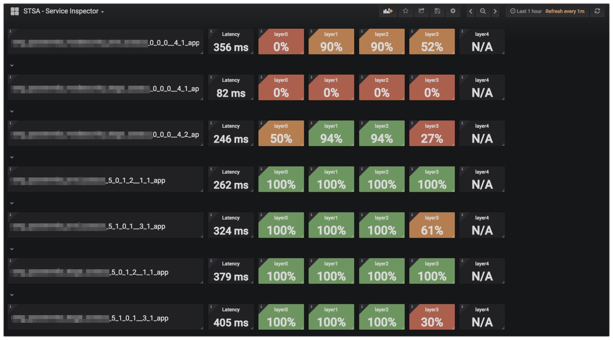

# swarm-traefik-state-analyzer

This project is intended to aid in the analysis of Docker Swarm services that are proxied by [Traefik](https://traefik.io/) in an "swarm footprint" architecture whereby services are segmented on the swarm/traefik by classification of being *internal* or *external* services. All inbound http(s) traffic for either segment passes through higher level proxies (layer4) or direct lb bound fqdns (layer3) on to its corresponding hard/software load balancer (layer2), to one of several Traefik instances (layer1), and then on to individual Swarm (layer0) service containers.

Triaging *"where the hell does the problem reside"* in such a setup can be a daunting task as there are many possible points of misconfiguration, hardware and software failures that can be the culprit.

- Are the service containers themselves ok?
- Are all my swarm nodes up?
- Is my service accessible and responding on the swarm pub port?
- Is Traefik functioning?
- Are all my Traefik labels working?
- Is Traefik on the right network to talk to the service?
- Is the DNS for these labels correct?
- Is the load-balancer pointing to the right Traefik backend?
- Is something busted in front of my load-balancer?
- Is the name/fqdn even pointing to the correct balancer or whatever is in front of that?
- Are there issues with TLS/SSL?

Ugh... well those kinds of questions is what this tool is intended to *assist* in helping to narrow down where to look next. These scripts collect relevant info from the swarm, generate all possible avenues of ingress across all layers for service checks to services on a swarm, and execute those checks giving detailed results.

By validating access directly through all possible layers of a Swarm/Traefik footprint you can help figure out what layers are having issues to properly stop the bleeding.

* [Architecture overview](#architecture)
  * [Swarm Info files](#swarminfo)
  * [Service State files](#servicestate)
* [Modules/Scripts overview](#modules)
  * [swarmstatedb.py](#swarmstatedb)
  * [servicechecksdb.py](#servicechecksdb)
  * [servicechecker.py](servicechecker.md)
  * [servicecheckerreport.py](servicecheckerreport.md)
  * [analyze-swarm-traefik-state.py](#analyze-swarm-traefik-state)
  * [servicecheckerdb2prometheus.py](servicecheckerdb2prometheus.md)
* [TLS/SSL diagnosis scripts](#tlsssltools)
  * [testsslinputgenerator.py](#testsslinputgenerator)
* [Grafana dashboards](#grafana)
* [Docker](#docker)

## <a id="architecture"></a>Architecture overview

This suite of modules is built around the following simple architecture

### Physical

* You have a Docker Swarm cluster made up of N hosts
*  The Swarm has two classifications of docker overlay networks on it
  - `external`: for services that receive requests from outside sources
  - `internal`: for services that receive requests from internal sources
*  Each network has a single designated [Traefik](https://traefik.io/) service that is published on a fixed swarm port. This Traefik service proxies all inbound HTTP/S traffic to other application services on that shared `internal` or `external` network.
*  Each fixed `internal/external` Traefik published port on the swarm (lets say `external` is 45900 and `internal` is 45800) receives its traffic from a corresponding designated internal/external load-balancer device (hardware or software) that resides on the network.
*  DNS for your deployed services points an appropriate device that will eventually proxy traffic to the appropriate internal or external load-balancer
*  Upstream from the load-balancers may be potentially other devices, firewalls, wafs, app proxies etc
*  Each of these DNS names are specified within a `traefik.[servicename].frontend.rule=Host:[name1],[nameN]..`label on each service

### Logical

*  Your applications are deployed as docker services on a target swarm.
*  An application runs within the scope of logical "context" (i.e. pre-prod, or prod, or qa etc)
*  A "context" generally implies a set of corresponding configuration that is different in some way to any other "context"
*  An application can have an optional "classifier" to give it additional categorization
*  A binary Docker image (i.e. my-app:10.0-beta-1) paired with a "context" and optional "classifier" yields an unique deployed docker service.
    * a deployed docker service has a naming convention `[appname]-[context]-[version][-classifier]` (i.e. `my-app-pre-prod-10-0-beta-1`)
*  The combination of a Docker image version, in scope of a "context" falls into one of three categories:
    * `current`: The current version of the application receiving live traffic bound to FQDNs representative of live traffic (i.e. www.my-app.test.com)
    * `previous`: The previous version of the application which receives traffic bound to unique FQDNs (i.e. my-app-pv.test.com)
    * `next`: The upcoming version of the application which receives traffic bound to special testing FQDNs (i.e. my-app-nv.test.com)
*  "Where" HTTP/S traffic goes for given standard FQDNs can easily be controlled by hot-swapping Traefik frontend rules via Docker service labels

### Deploying services

The "how" of how you deploy and manage your services based on this swarm/traefik footprint architecture and docker service naming conventions based around the [swarminfo.yml files](#swarminfo) and [service-state.yml files](#servicestate) is up to you. You can build automation around this using any programming language of your choice or DevOps toolsets like Ansible.

## <a id="modules"></a>Modules/Scripts

This project provides multiple modules who's input/output can be used between each other or each can just be used independently on their own.

1. [swarmstatedb.py](#swarmstatedb): to collect raw docker swarm service state into a JSON db
1. [servicechecksdb.py](#servicechecksdb): decorates all the layer service checks for services discovered by `swarmstatedb`
1. [servicechecker.py](servicechecker.md): executes the service checks generated by `servicechecksdb`, records results
1. [servicecheckerreport.py](servicecheckerreport.md): reads `servicechecker` output and prepares a simple report  
1. [analyze-swarm-traefik-state.py](#analyze-swarm-traefik-state): orchestrates the above steps in one simple command
1. [servicecheckerdb2prometheus.py](servicecheckerdb2prometheus.md): monitors a directory for `servicechecker` output and exposes as Prometheus`/metrics`


## <a id="swarmstatedb"></a>swarmstatedb.py

This script will interrogate a target swarm for services matching `--service-filter` and dump a summarized subset of the relevant information in a JSON file which can then be consumed by `servicechecksdb.py`...or whatever else you want to do with it. The information it extracts contains published port information, traefik labels, image info, number of replicas amongst other things.

```bash
./swarmstatedb.py --output-filename [filename] \
  --swarm-info-repo-root /pathto/[dir containing swarm-name.yml files] \
  --swarm-name [swarm-name] \
  --service-filter '{"name":"some-service-name prefix"}' \
```

Options:
* `--swarm-info-repo-root`: dir that anywhere in its subdirectories contains `[swarm-name].yml` files that contain the information as described in the `[swarm-name].yml` files section
* `--service-filter`: filters (dict) – Filters to process on the nodes list. Valid filters: id, name , label and mode.
* `--swarm-name`: the logical swarm name you are interrogating
* `--output-filename`: path where the JSON output will be written
* `--log-file`: path to log file, otherwise STDOUT
* `--log-level`: python log level (DEBUG, WARN ... etc)
* `--service-name-exclude-regex`: Optional, to further refine the set of services by docker service name that are returned via the --service-filter, will exclude any services matching this regex

Produces output:
```
[
    {
        "swarm_name": "myswarm1",
        "id": "xxxx",
        "name": "my-app-prod-11-beta2_app",
        "image": "my-app:11-beta2",
        "int_or_ext": "external",
        "replicas": 4,
        "port_mappings": [
            "30001:443"
        ],
        "traefik_host_labels": [
            "my-app-prod.test.com",
            "bitsofinfo.test.com",
            "my-app-prod-11-beta2.test.com"
        ]
    }
```

## <a id="servicechecksdb"></a>servicechecksdb.py

This script consumes the output from `swarmstatedb.py` and supplements it with information from `[swarm-name].yml`, and one or more relevant `service-state.yml` files to compute an exhaustive list of all possible ingress paths to invoke the appropriate service checks for each service exposed on the swarm via each layer of access (0:swarm direct, 1:traefik direct, 2:load-balancers, and 3:normal fqdns).

Depending on the number of ports your application exposes, number of swarm nodes and corresponding Traefik frontend `Host` header based labels you have applied to a service... this can result many pre-computed ingress check combinations.

You can use the generated JSON file that contains all the necessary information (urls, headers, methods, payloads etc) to drive any monitoring system you'd like.... or just feed into the provided `servicechecker.py` to execute all the service checks and write a detailed report out... again in JSON.

```bash
./servicechecksdb.py --input-filename [swarmstatedb output file] \
  --swarm-info-repo-root /pathto/[dir containing swarm-name.yml files] \
  --service-state-repo-root /pathto/[dir containing service-state.yml files]
  --output-filename [filename] \
  [--layers 0 1 2 3 4] \
  [--tags health foo bar]
```

Options:
* `--swarm-info-repo-root`: dir that anywhere in its subdirectories contains `[swarm-name].yml` files that contain the information as described in the `[swarm-name].yml` files section
* `--service-state-repo-root`: dir that anywhere in its subdirectories contains `service-state.yml` files that contain the information as described in the `service-state.yml` files section
* `--layers`: layers to generate actual checks for in the output database (default all)
* `--tags`: only for service checks w/ given tags (default any)
* `--fqdn-filter`: regex string to limit urls that get computed for checks within specified layers
* `--input-filename`: path where the JSON output of `swarmstatedb.py` is
* `--output-filename`: path where the JSON output will be written
* `--log-file`: path to log file, otherwise STDOUT
* `--log-level`: python log level (DEBUG, WARN ... etc)

Decorates additional info to `swarmstatedb` output from `service-state.yml` files:
```
  ...
  "warnings": [],
  "context": {
      "name": "prod",
      "version": "10",
      "tags": [
          "current"
      ]
  },
  "formal_name": "my-app",
  "app_type": "go",
  "aliases": [
      "my-alias2",
      "my-alias1"
  ],
  "service_checks": {
      "layer0": [
          {
              "layer": 0,
              "url": "https://myswarm1-node1.test.com:30001/health",
              "target_container_port": 443,
              "host_header": null,
              "headers": [
                  "test2: yes"
              ],
              "method": "GET",
              "timeout": 5,
              "retries": 5,
              "tags" : [
                  "foo",
                  "health"
              ],
              "description": "my-app-prod-11-beta2_app swarm service port direct"
          },
          ...
        ],
      "layer1": [
          {
              "layer": 1,
              "url": "https://myswarm1-node1.test.com:45900/health",
              "target_container_port": 443,
              "host_header": "my-app-prod.test.com",
              "headers": [
                  "test2: yes"
              ],
              "method": "GET",
              "timeout": 5,
              "retries": 5,
              "tags" : [
                  "foo",
                  "health"
              ],
              "description": "my-app-prod-11-beta2_app via traefik direct"
          },
          ...
        ],
      "layer2": [
          {
              "layer": 2,
              "url": "https://myswarm1-extlb.test.com/health",
              "target_container_port": 443,
              "host_header": "my-app-prod.test.com",
              "headers": [
                  "test2: yes"
              ],
              "method": "GET",
              "timeout": 5,
              "retries": 5,
              "tags" : [
                  "foo",
                  "health"
              ],
              "description": "my-app-prod-11-beta2_app via load balancer direct"
          },
          ...
        ],
      "layer3": [
          {
              "layer": 3,
              "url": "https://my-app-prod.test.com/health",
              "target_container_port": 443,
              "host_header": null,
              "headers": [
                  "test2: yes"
              ],
              "method": "GET",
              "timeout": 5,
              "retries": 5,
              "tags" : [
                  "foo",
                  "health"
              ],
              "description": "my-app-prod-11-beta2_app via normal fqdn"
          },
      "layer4": [
          {
              "layer": 4,
              "url": "https://my-app-prod-mode-a.test.com/api/2.7/submit-report",
              "target_container_port": null,
              "host_header": null,
              "headers": [
                  "Content-Type: text/json"
              ],
              "basic_auth": "user@test.com:123",
              "body": "{ \"request_data\":\"XXXXXX\", \"text_version\":\"14a-c blah, blah, blah\" }",
              "is_healthy": {
                  "response_codes": [
                      200
                  ],
                  "body_evaluator": {
                      "type": "contains",
                      "value": "check-code=100A"
                  }
              },
              "method": "POST",
              "timeout": 10,
              "retries": 5,
              "tags" : [
                  "foo",
                  "health"
              ],
              "description": "my-app-prod-11-beta2_app via layer 4 custom: https://my-app-prod-mode-a.test.com"
          },
          ...
        ]

  ...
```


## <a id="analyze-swarm-traefik-state"></a>analyze-swarm-traefik-state.py

This script orchestrates all the following steps with one command:

1. Invokes: [swarmstatedb.py](#swarmstatedb) to collect raw docker swarm service state database
1. Invokes: [servicechecksdb.py](#servicechecksdb)to create database of service checks for the swarm state
1. Invokes: [servicechecker.py](#servicechecker) which executes the service checks, captures results
1. Invokes: [servicecheckerreport.py](#servicecheckerreport) reads and prepares a simple report  

All of the data generated from `analyze-swarm-traefik-state.py` is stored by default under the `output/` dir within this project.

```
./analyze-swarm-traefik-state.py --job-name [name] \
  --swarm-info-repo-root /pathto/[dir containing swarm-name.yml files] \
  --service-state-repo-root /pathto/[dir containing swarm-state.yml files] \
  --swarm-name [name] \
  --service-filter '{"name":"some-service-name prefix"}' \
  --layers 0 1 2 3 4 \
  --tags health foo bar \
  --threads 30 \
  --output-dir output/ \
  --stdout-servicecheckerreport-result \
  [--verbose]
```

Options:
* `--stdout-servicecheckerreport-result`: print servicecheckerreport.md output to STDOUT in addition to file
* `--stdout-servicechecker-result`: print servicechecker raw results to STDOUT in addition to disk
* `--log-stdout`: will log to STDOUT, if not present will log within `--output-dir`
* `--log-level`: python log level (DEBUG, WARN ... etc)
* `--fqdn-filter`: regex string to limit urls that get computed for checks within specified layers
* `--sleep-seconds`: The max amount of time to sleep between all attempts for each service check; if > 0, the actual sleep will be a random time from 0 to this value
* `--daemon`: Run as a long lived process, re-analyzing per interval settings
* `--daemon-interval-seconds`: When in daemon mode, how long to sleep between runs, default 300
* `--daemon-interval-randomize`: When in daemon mode, if enabled, will randomize the sleep between --daemon-interval-seconds and (--daemon-interval-seconds X 2)
* `--pre-analyze-script-path`: Optional, path to executable/script that will be invoked prior to starting any analysis. If --daemon this will be invoked at the start of each iteration.
* `--retain-output-hours`: Optional, default 1, the number of hours of data to retain, purges output dirs older than this time threshold
* `--service-name-exclude-regex`: Optional, to further refine the set of services by docker service name that are returned via the --service-filter, will exclude any services matching this regex`

The meaning for the options above are the same as and described in the separate sections above for each separate module


## <a id="tlsssltools"></a>TLS/SSL diagnosis scripts

Another cause of issues can typically be TLS/SSL related, expired certificates, unsupported ciphers, invalid names etc. A great tool out there is [https://github.com/drwetter/testssl.sh](https://github.com/drwetter/testssl.sh) and the scripts below can be used to consume the data from the `servicechecksdb` to provide `testssl.sh` command inputs to automate TLS/SSL checking your apps via their various entrypoints (unique fqdns).

1. [testsslinputgenerator.py](#testsslinputgenerator): Reads a `servicechecksdb.json` output file to produce a `testssl_input.txt` file that can be used to feed `testssl.sh` invocations.


## <a id="testsslinputgenerator"></a>testsslinputgenerator.py

```bash
./testsslinputgenerator.py --input-filename [filename] \
  --output-filename [filename] \
  --testssl-nonfile-args [single quoted args] \
  --testssl-outputdir [relative or full path to a dir] \
  --fqdn-filter [single quoted regex] \
  --uri-bucket-filter [single quoted regex] \
  --collapse-on-fqdn-filter [single quoted regex]
```

Options:
* `--input-filename`: name of the input file (i.e. this must be the output file of `servicecheckerdb.py`)
* `--output-filename`: name of the file to output the `testssl.sh` commands in. This file can be used to feed `testssl.sh`
* `--testssl-outputmode`: for each command generated, the filenames by which the testssl.sh `-*file` output file arguments will be generated. Default `files`. If `dirs` a unique dir structure will be created based on `swarmname/servicename/fqdn/[timestamp].[ext]`, if `files` each output file will be in the same `--testssl-outputdir` directory but named such as `swarmname__servicename__fqdn__[timestamp].[ext]`
* `--testssl-nonfile-args`: any valid `testssl.sh` argument other than any of the `testssl.sh` output `--*file` arguments such as `--jsonfile, --csvfile` etc. Why? because this script will auto generate those for you. The defaults for this are `-S -P -p --fast`
* `--testssl-outputdir`: for each `testssh.sh` command generated into the `--output-filename` this will be the the root output dir for all generated `testssl.sh` `--*file` arguments, default value: `testssl_output`
* `--log-file`: path to log file, otherwise STDOUT
* `--log-level`: python log level (DEBUG, WARN ... etc)
* `--fqdn-filter`: Regex filter to limit which FQDNs from the `--input-filename`'s `service_record.unique_entrypoint_uris.[bucket].[fqdns]` are actually included in the generated `--output-filename`
* `--uri-bucket-filter`: Regex filter to limit which `unique_entrypoint_uris.[bucketname]` to actually include in the output
* `--collapse-on-fqdn-filter`: Capturing Regex filter to match on fqdns that share a common element and limit the generated output to only one of those matches, the first one found. For wildcard names, this might be something like `'.*(.wildcard.domain)|.*(.wildcard.domain2)'`

Produces output for `testssl.sh` to consume:
```
-S -P -p --fast --logfile testssl_output/myswarm1/my-app-prod-11-beta2_app/my-app-prod.test.com/result.log \
  --jsonfile-pretty testssl_output/myswarm1/my-app-prod-11-beta2_app/my-app-prod.test.com/result.json \
  --csvfile testssl_output/myswarm1/my-app-prod-11-beta2_app/my-app-prod.test.com/result.csv \
  --htmlfile testssl_output/myswarm1/my-app-prod-11-beta2_app/my-app-prod.test.com/result.html \
  https://my-app-prod.test.com
-S -P -p --fast --logfile testssl_output/myswarm1/my-app-prod-11-beta2_app/bitsofinfo.test.com/result.log \
  --jsonfile-pretty testssl_output/myswarm1/my-app-prod-11-beta2_app/bitsofinfo.test.com/result.json \
  --csvfile testssl_output/myswarm1/my-app-prod-11-beta2_app/bitsofinfo.test.com/result.csv \
  --htmlfile testssl_output/myswarm1/my-app-prod-11-beta2_app/bitsofinfo.test.com/result.html \
  https://bitsofinfo.test.com
```

Which could then be consumed by `testssl.sh` such as:

```
./testssl.sh -f testssl_input.txt
```

Or write your own program to parse it and spawn your own execs of `testssl.sh`

## <a id="grafana"></a>Grafana dashboards

Several Grafana dashboards are provided which consume the metrics produced by `servicecheckerdb2prometheus.py`. The dashboards are in json format within the `grafana/` dir

**Overall Status**

This dashboard presents a quick overall status for a target swarm. You can also use the drop downs at the top to filter down by context and formal app name.

**Service Inspector**

This dashboard presents a quick single line status view for every layer within every service deployed and being monitored via service checks defined in service-state.yml files

**Layer Inspector**

This dashboard presents detailed analytics organized by **layer**. At the top of the dashboard you can drill down into the data consumed by all metric `labels` generated by the `servicecheckerdb2prometheus.py` module which labels the metrics via numerous slices according to the footprint and service-state.yml file attributes (service name, swarm, classifiers, tags, context etc)

**Error Inspector**

This dashboard presents a view of whats going on with an error perspective. Percentage of failures, failed service checks organized by FQDN etc.

**Alerts: global**

This dashboard is where several core health percentage and latency based alerts can be configured, both at the global level as well as per layer. Note at the time of this writing, Grafana does not support alerts on variable based queries hence this separate dashboard.

|Overall Status|Service Inspector|
:-------------------------:|:-------------------------:
|
|Global Alerts|Layer Inspector|
|
|Error Inspector||
||

## <a id="swarminfo"></a>[swarm-name].yml files

Swarm info files, are a generic YAML declaration that describes a named swarm footprint in the described architecture above.

```yaml
SWARM_MGR_URI: "http://myswarm1.test.com:[port]"

swarm_lb_endpoint_internal: "myswarm1-intlb.test.com"
swarm_lb_endpoint_external: "myswarm1-extlb.test.com"

traefik_swarm_port_internal_https: 45800
traefik_swarm_port_external_https: 45900

contexts:
  - "prod"
  - "pre-prod"

swarm_host_info:
  template: "myswarm1-node{id}.test.com"
  total_nodes: 5

```

## <a id="servicestate"></a>service-state.yml files

Service state files, are a generic YAML declaration that describes a named "service" that can be deployed within the described architecture above on one or more target swarms


```yaml
formal_name: "my-servicename"
app_type: "go"

classifiers:
  mode-a:
    desc: "operation mode A"
  mode-b:
    desc: "operation mode B"

aliases:
  - "my-alias1"
  - "my-alias2"

service_ports:
  443:
    name: "https access port"
    desc: "description"
    protocol: "https"
    classifiers:
      - "mode-a"
      - "mode-b"

service_checks:
  - ports: [443]
    path: "/health"
    layers: [0,1,2,3]
    headers:
      - "test2: yes"
    method: "GET"
    timeout: 10
    retries: 3
    tags: ["foo","health"]
  - ports: [443]
    layers: [0,1,2,3]
    path: "/api/2.7/submit-report"
    method: "POST"
    headers:
      - "Content-Type: text/json"
    body: >
      {
        "request_data":"XXXXXX",
        "text_version":"14a-c blah, blah, blah",
      }
    is_healthy:
      response_codes: [200]
      body_evaluator:
        type: "jinja2"
        template: "10"
    timeout: 5
    retries: 5
    classifiers: ["mode-a"]
    tags: ["version"]
  - ports: [443]
    layers: [4]
    path: "/api/2.7/submit-report"
    method: "POST"
    headers:
      - "Content-Type: text/json"
    basic_auth: "user@test.com:123"
    body: >
      {
        "request_data":"XXXXXX",
        "text_version":"14a-c blah, blah, blah",
      }
    is_healthy:
      response_codes: [200]
      body_evaluator:
        type: "contains"
        value: "result = 100A"
    timeout: 5
    retries: 5
    classifiers: ["mode-a"]
    tags: ["bar","health"]
    contexts:
      prod:
        url_roots:
          - "https://my-app-prod-mode-a.test.com"
      pre-prod:
        url_roots:
          - "https://my-app-pre-prod-mode-a.test.com"

contexts:
  prod:
    versions:
      current: "10"
      previous: "9"
      next: "12-beta1"
  pre-prod:
    versions:
      current: "10"
      previous: "9"
      next: "12-beta1"
```

## <a id="docker"></a>Docker

You can also run the any of the modules in this project via Docker.

Example:
```
docker build -t swarm-traefik-state-analyzer .

docker run \
  -v path/to/service-state-files-dir/:/service-state \
  -v path/to/service-info-files-dir/:/swarm-info \
  -v /tmp/output/:/output \
  swarm-traefik-state-analyzer \
  analyze-swarm-traefik-state.py \
    --job-name myapp-prod \
    --output-dir /output \
    --swarm-info-repo-root /swarm-info \
    --service-state-repo-root /service-state \
    --swarm-name myswarm1 \
    --service-filter '{"name":"myapp-prod"}' \
    --layers  3  \
    --threads 30 \
    --tags health version \
    --stdout-servicechecker-result
```
