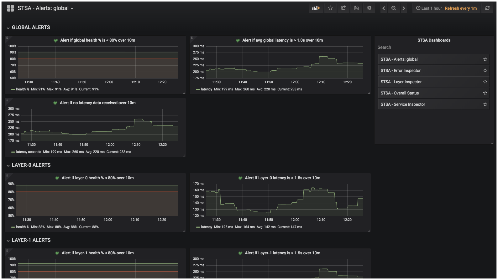
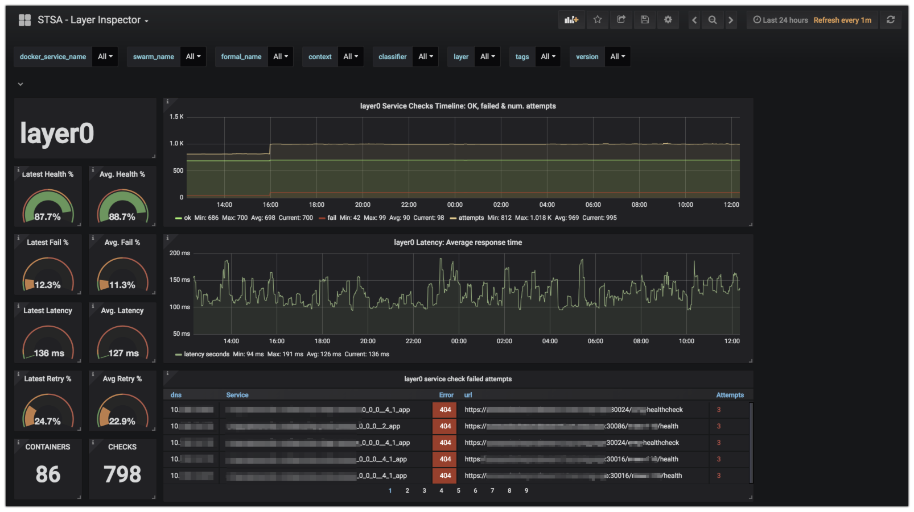

## Grafana dashboards

[Back to main README](../README.md)

Several Grafana dashboards are provided which consume the metrics produced by `servicecheckerdb2prometheus.py`. The dashboards are in json format within the `grafana/` dir

**Overall Status**

This dashboard presents a quick overall status for a target swarm. You can also use the drop downs at the top to filter down by context and formal app name.

**Service Inspector**

This dashboard presents a quick single line status view for every layer within every service deployed and being monitored via service checks defined in service-state.yml files

**Layer Inspector**

This dashboard presents detailed analytics organized by **layer**. At the top of the dashboard you can drill down into the data consumed by all metric `labels` generated by the `servicecheckerdb2prometheus.py` module which labels the metrics via numerous slices according to the footprint and service-state.yml file attributes (service name, swarm, classifiers, tags, context etc)

**Error Inspector**

This dashboard presents a view of whats going on with an error perspective. Percentage of failures, failed service checks organized by FQDN etc.

**Alerts: global**

This dashboard is where several core health percentage and latency based alerts can be configured, both at the global level as well as per layer. Note at the time of this writing, Grafana does not support alerts on variable based queries hence this separate dashboard.

|Overall Status|Service Inspector|
:-------------------------:|:-------------------------:
|
|Global Alerts|Layer Inspector|
|
|Error Inspector||
||

[Back to main README](../README.md)
